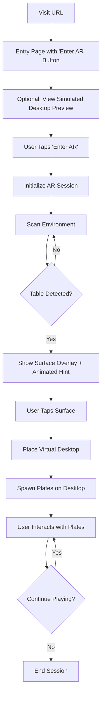

# Product Requirements Document: AR Virtual Desktop Experience

## Overview

An immersive WebXR-based augmented reality experience that transforms real-world tables into interactive virtual desktops with physics-enabled objects. Users can place virtual desktops on detected surfaces and interact with draggable, throwable plates that exhibit realistic collision behavior.

## Target Platforms

**Primary (MVP Testing)**
- Android devices with WebXR-enabled Chrome browser
- Touch-based interaction model

**Immediate Fast-Follow**
- Meta Quest browser (after Android testing complete)
- Controller-based interaction
- Hand tracking (if supported by WebXR API)

## Core Features

### 1. Entry Experience

**Requirements**
- Landing page displays when user visits URL
- "Enter AR" button prominently positioned
- Optional: Simulated 3D desktop preview on entry page (non-AR)
- Button initiates WebXR AR session

**Acceptance Criteria**
- Entry page loads within 1 second
- Button is clearly visible and accessible
- Smooth transition from entry page to AR session

### 2. Surface Detection & Visualization

**Requirements**
- Detect horizontal plane surfaces (tables) in the real world using WebXR Hit Test API
- Display semi-transparent shader overlay on detected table surfaces
- Show persistent hint text: "Tap a table to place virtual desktop"
- Hint text continuously animates (fade in/out) to encourage user interaction
- Hint text positioned at bottom of screen, readable in AR context

**Acceptance Criteria**
- Surface detection initializes within 2 seconds of AR session start
- Detected surfaces update in real-time as user moves device
- Visual feedback is clear and non-intrusive

### 3. Virtual Desktop Placement

**Requirements**
- Single tap interaction to place desktop on detected surface
- Desktop dimensions match detected table surface size
- Desktop remains anchored to real-world position
- Only one desktop can be placed at a time (for MVP)

**Acceptance Criteria**
- Desktop placement is accurate within 5cm of tap location
- Desktop orientation aligns with detected surface plane
- Desktop persists throughout AR session

### 4. Interactive Plates

**Physical Properties**
- Plate dimensions: Maximum 15cm (0.15m) width × 15cm depth × reasonable height (2-3cm)
- Circular or square shape (to be determined during implementation)
- Bounded physics: plates cannot fall off desktop edges
- Realistic collision detection between plates

**Interaction Model**
- **Drag**: Touch and move to reposition plates on desktop
- **Throw**: Quick swipe gesture imparts velocity to plates
- **Collision**: Plates bounce off each other with realistic physics

**Spawn Behavior**
- Multiple plates spawn automatically when desktop is placed
- Initial quantity: 5-8 plates
- Random but non-overlapping initial positions
- Plates spawn with slight vertical offset, then settle onto desktop

**Acceptance Criteria**
- Plates respond to touch within 100ms
- Physics simulation runs at minimum 30 FPS
- Collision detection is accurate and visually convincing
- Plates never escape desktop boundaries

### 5. Visual Design

**Rendering Approach**
- PBR (Physically Based Rendering) materials
- Simple solid colors with proper lighting response
- Edge definition through normal mapping and lighting
- Subtle shadows for depth perception

**Color Palette**
- Desktop: Neutral tone (gray/white) with slight transparency
- Plates: Vibrant, distinct colors for easy differentiation
- Detected surfaces: Semi-transparent blue/cyan overlay

**Performance Target**
- Maintain 60 FPS on target Android devices
- Smooth physics simulation without jitter

## User Flow

## Technical Requirements

### WebXR APIs
- `immersive-ar` session mode
- Hit test API for surface detection
- Input source tracking for touch/tap events
- Anchors API for persistent placement

### Physics Engine
- Lightweight 3D physics library (e.g., Cannon.js, Ammo.js)
- Collision detection and response
- Velocity and friction simulation
- Boundary constraints

### 3D Rendering
- Three.js or Babylon.js for WebGL rendering
- PBR material support
- Real-time lighting and shadows
- Efficient geometry management

### Performance Constraints
- Maximum draw calls: 50-100 per frame
- Texture memory: < 50MB
- Physics calculations: < 5ms per frame
- Total bundle size: < 2MB (excluding libraries)

## Out of Scope (MVP)

- Multiple simultaneous desktops
- Customizable plate shapes/sizes
- Persistent sessions across app restarts
- Multiplayer/shared experiences
- Audio feedback
- Advanced gestures (pinch, rotate)
- Desktop customization options
- Complex entry page interactions (keep simple for MVP)

## Success Metrics

**Technical Performance**
- AR session initialization: < 3 seconds
- Frame rate: Consistent 60 FPS
- Touch response latency: < 100ms

**User Experience**
- Surface detection success rate: > 90%
- Placement accuracy: Within 5cm of intended location
- Physics interactions feel natural and responsive

## Future Enhancements

1. **Meta Quest Support**
   - Controller-based grab and throw mechanics
   - Hand tracking integration
   - Improved spatial audio

2. **Enhanced Interactions**
   - Plate stacking
   - Different object types (cups, books, etc.)
   - Customizable desktop themes

3. **Advanced Features**
   - Multi-desktop support
   - Session persistence
   - Social/multiplayer features
   - Screenshot/recording capabilities

## Risk Assessment

| Risk | Impact | Mitigation |
|------|--------|------------|
| WebXR browser support limited | High | Provide clear device compatibility list, fallback messaging |
| Physics performance on mobile | Medium | Optimize physics calculations, reduce plate count if needed |
| Surface detection accuracy | Medium | Implement manual placement fallback, improve visual feedback |
| Touch interaction conflicts with AR | Medium | Implement clear interaction zones, visual touch indicators |

## Development Timeline Estimate

- **Phase 0**: Entry page & simulated desktop preview (1-2 days)
- **Phase 1**: Core AR setup & surface detection (3-5 days)
- **Phase 2**: Desktop placement & anchoring (2-3 days)
- **Phase 3**: Physics integration & plate spawning (4-6 days)
- **Phase 4**: Interaction implementation (3-4 days)
- **Phase 5**: Visual polish & optimization (2-3 days)
- **Phase 6**: Android testing & bug fixes (2-3 days)
- **Phase 7**: Meta Quest fast-follow adaptation (2-4 days)

**Total MVP Development (Android)**: 17-26 days
**With Meta Quest Fast-Follow**: 19-30 days

## Dependencies

- WebXR Device API support in Chrome for Android
- Android device with ARCore support
- HTTPS hosting for WebXR requirements
- 3D rendering library (Three.js recommended)
- Physics engine library (Cannon.js recommended)
